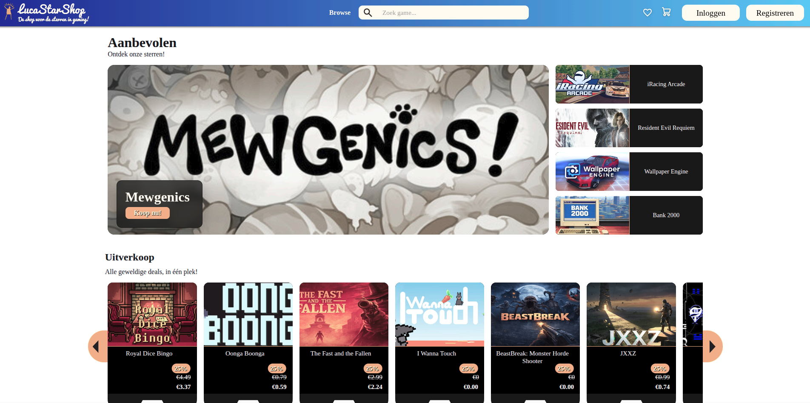

# Starshop

A webshop for browsing and purchasing game licenses, built as a group project (team "1-Mula") during HBO-ICT (Block 4). The main learning goal was working with third-party APIs.



## About

Starshop lets users browse, search, and purchase game licenses, with all game data pulled live from external sources and payments handled through Stripe. The stack is TypeScript throughout — an Express backend and a Lit-based frontend — deployed on Railway (API) and Vercel (frontend + serverless payment functions).

**Live demo:** [webshop-api-4vlr.vercel.app](https://webshop-api-4vlr.vercel.app)

## Features

- Browse and search game catalog with live data from Steam
- View detailed game information including community stats
- Shopping cart and checkout flow
- Stripe payment integration
- Responsive mobile-optimized frontend
- Client-server architecture with API proxy pattern

## Tech Stack

| Layer | Technology |
|-------|-----------|
| Language | TypeScript (79%), CSS (17.2%), JavaScript (2.4%), HTML (1.4%) |
| Frontend | Lit (Web Components) |
| Backend | Express.js (Node.js) |
| Build Tools | Vite (client), esbuild (server) |
| Payments | Stripe API |
| Game Data | Steam Store API, SteamSpy API |
| Database | SQL |
| Deployment | Vercel (frontend), Railway (API) |
| CI/CD | GitLab CI |

## Third-Party APIs

**Steam Store API** — Primary data source for game information and pricing. The backend proxies requests to Steam's endpoints so the frontend never talks to Steam directly.

**SteamSpy API** — Used alongside the Steam Store API to get community data like review scores, player counts, and genre tags that Steam's own API doesn't expose easily.

**Stripe API** — Handles the entire checkout and payment flow. A dedicated StripeService on the backend creates Checkout Sessions and verifies payment status, keeping the secret key server-side.

## Getting Started

### Prerequisites

- [Visual Studio Code](https://code.visualstudio.com/)
- [Node.js](https://nodejs.org/) (version `20.x.x`)
- [Git](https://git-scm.com/)

### Recommended VS Code Extensions

- [ESLint](https://marketplace.visualstudio.com/items?itemName=dbaeumer.vscode-eslint)
- [EditorConfig](https://marketplace.visualstudio.com/items?itemName=editorconfig.editorconfig)
- [lit-plugin](https://marketplace.visualstudio.com/items?itemName=runem.lit-plugin)

### Installation

```bash
git clone https://github.com/MEvan774/Webshop.git
cd Webshop
npm install
```

Set up the database using `database.sql`, then configure the database connection in `src/api/.env`.

Start the server:
```bash
cd src/api
npm run dev
# API available at http://127.0.0.1:3001
```

Start the client:
```bash
cd src/web
npm run dev
# App available at http://127.0.0.1:3000
```

## Project Structure

```
Webshop/
├── src/
│   ├── api/         # Express.js backend
│   └── web/         # Lit-based frontend
├── docs/            # Project documentation
├── screenshots/     # Application screenshots
├── database.sql     # Database setup script
├── vercel.json      # Vercel deployment config
├── nixpacks.toml    # Railway deployment config
└── package.json
```

## What I Learned

- Integrating and orchestrating multiple third-party APIs
- Secure payment processing with Stripe (server-side secret key management)
- API proxy pattern to abstract external services from the frontend
- Deploying a full-stack application across multiple platforms (Vercel + Railway)
- Collaborative development with GitLab CI/CD pipelines
