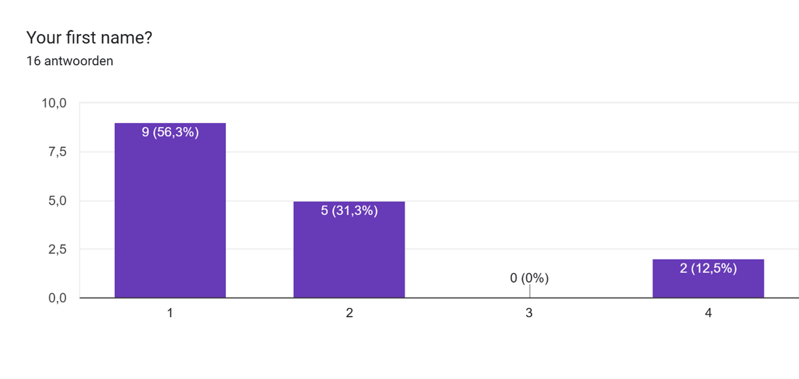
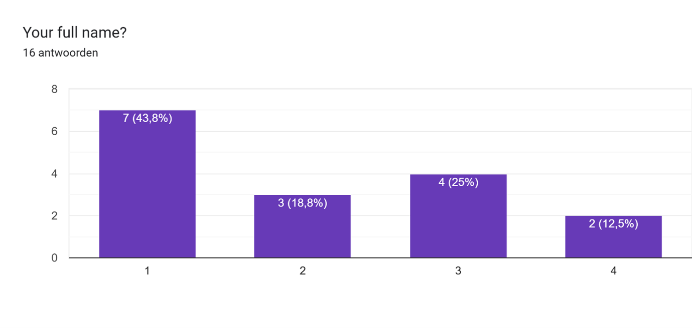
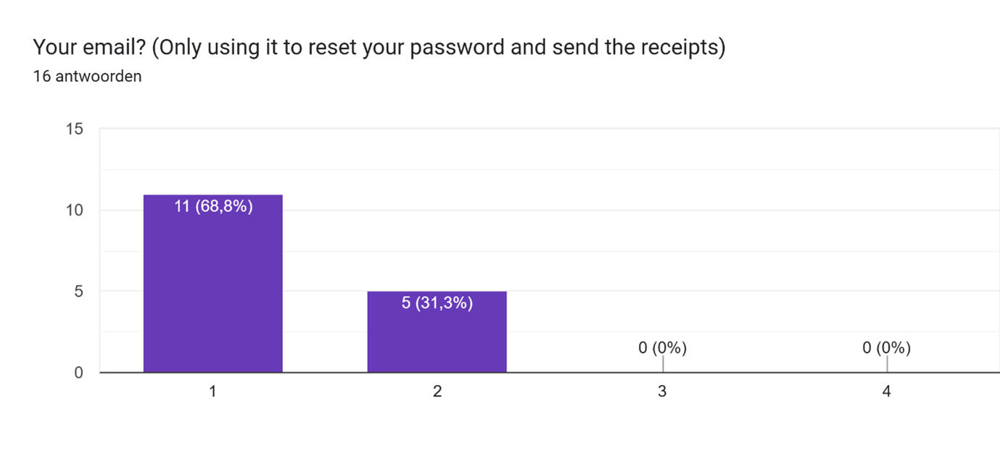
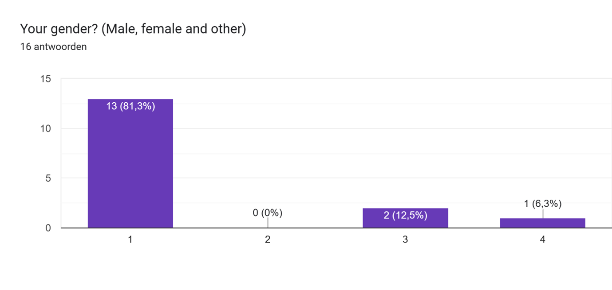
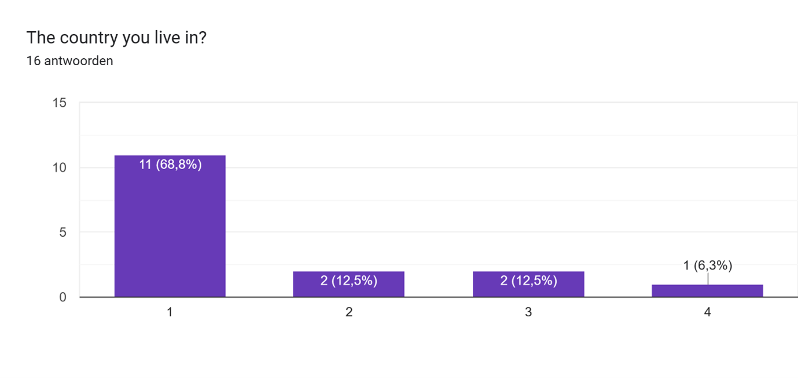
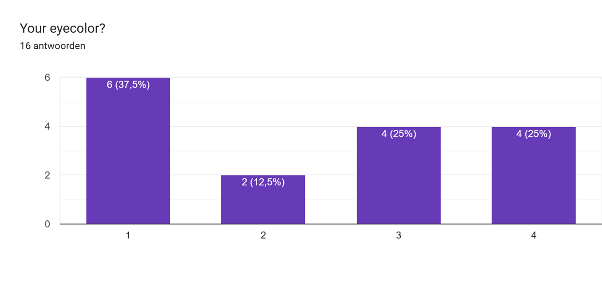
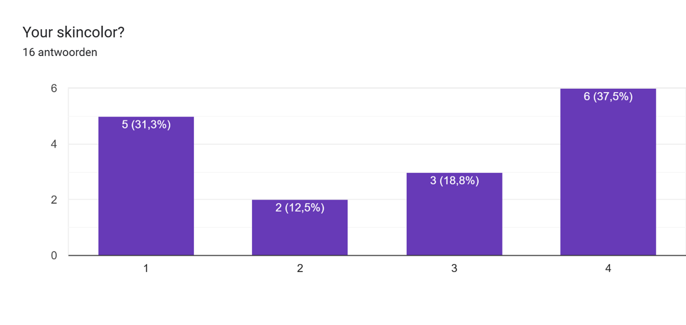

# Hoe ontwerp je een webshop die goed werkt, veilig is, makkelijk te gebruiken is en past bij wat de gebruikers en het bedrijf nodig hebben?
### Door: Anne Bakker, Milan Breuren en Lisa Hakhoff

## Inhoudsopgave
- [Samenvatting](#samenvatting)
- [Inleiding](#inleiding)
- [Deelvraag 1: Software](#software-welke-afspraken-zijn-er-gemaakt-om-te-zorgen-dat-de-website-eenduidig-is-alsof-deze-door-één-persoon-gemaakt-is)
- [Deelvraag 2: Gebruikersinteractie](#gebruikersinteractie-welke-elementen-dragen-volgens-frequente-online-shoppers-1870-jaar-bij-aan-de-gebruiksvriendelijkheid-van-een-webshop)
- [Deelvraag 3: Ethiek](#ethiek-wat-zijn-best-practices-voor-het-veilig-en-ethisch-opslaan-van-persoonsgegevens-binnen-een-webshop-met-oog-op-privacy-gebruikersbelang-en-toestemming)
- [Conclusie](#conclusie)
- [Literatuurlijst](#literatuurlijst)
- [Bijlagen](#bijlagen)

## Samenvatting
Dit onderzoek is gestart om er achter te komen hoe 1-Mula de webshop Starshop goed kan ontwerpen. Hierbij wordt er gefocust op een fijne en makkelijke werking voor de gebruikers en de veiligheid van de gegevens van de gebruikers. Om deze deelvraag te beantwoorden, is dit opgesplitst 3 deelvragen, namelijk:

1. Welke afspraken zijn er gemaakt om te zorgen dat de website eenduidig is, alsof deze door één persoon gemaakt is?
2. Welke elementen dragen volgens frequente online shoppers (18–70 jaar) bij aan de gebruiksvriendelijkheid van een webshop?
3. Wat zijn de best practices voor het veilig en ethisch opslaan van persoonsgegevens binnen een webshop, met oog op privacy, gebruikersbelang en toestemming?

In deelvraag 3 is er nagedacht over welke persoonsgegevens van de gebruikers van de webshop opgeslagen worden, op een manier dat ethisch verantwoord is en wettelijk is toegestaan.

Uit dit onderzoek is gekomen dat het opslaan en verwerken van de huidskleur van de gebruiker niet toegestaan is volgens de AVG. Ook de oog- en haarkleur van gebruikers mag niet worden opgeslagen en verwerkt, tenzij hier een goede reden voor is. Aangezien 1-Mula hier geen geldige reden voor heeft, is er besloten ook dit niet op te slaan van de gebruikers. Deze beslissingen zijn niet alleen wettelijk niet toegestaan, 1-Mula heeft hier ook voor gekozen omdat het verzamelen van deze gegevens kan leiden tot discriminatie op basis van haar- en huidskleur. 1-Mula heeft er wel voor gekozen de locatie en het gender van de gebruiker op te slaan, aangezien dit voor marketing en personalisatie van het account gebruikt kan worden. Deze gegevens zijn echter wel mogelijk niet op te geven bij het aanmaken van een account, indien de gebruiker dit niet wil delen.

Dit onderzoek heeft er niet alleen geleid tot afspraken over de persoonsgegevens die verzameld gaan worden van de gebruiker. Hier is namelijk ook uit gekomen dat het wachtwoord opgeslagen moet worden in hashing, en niet direct in de database opgeslagen mag worden. Daarnaast blijkt dat bij het opslaan van persoonsgegevens bij aanmaak van een account er toestemming moet worden gegeven op de gebruikersvoorwaarden, en dat er bij aanmaak van een account voor minderjarigen toestemming van een ouder of voogd vereist is.

## Inleiding

## Software: Welke afspraken zijn er gemaakt om te zorgen dat de website eenduidig is, alsof deze door één persoon gemaakt is?

### Samenvatting
In dit verslag onderzoeken we welke teamafspraken zijn gemaakt om de webshop eruit te laten zien alsof die door één persoon is ontworpen. Bij samenwerking tussen meerdere programmeurs kunnen stijl- en structuurverschillen ontstaan, tenzij hier duidelijke afspraken over zijn. We hebben gewerkt met gezamenlijke templates, afgesproken kleuren en typografie, en codeconventies zoals vaste naamgevingen. Dit draagt bij aan een overzichtelijke en professionele website. Toch zijn er verbeterpunten: niet alles is goed vastgelegd en soms wijkt iemand af van de afspraken.
Aanbevelingen:
- Verzamel alle afspraken op één centrale plek.
- Plan korte overleggen om de naleving te bewaken.
- Evalueer aan het eind wat werkte en wat beter kan.
Zo zorgen we voor een consistente uitstraling en betere gebruikerservaring.

### Inleiding
In dit rapport onderzoeken we hoe we eenduidigheid in ons project kunnen creëren en vastleggen. Deze documentatie dient als naslagwerk voor onze werkwijze als team.
We werken met vier personen aan de webshop voor Lucastars. Omdat we gelijktijdig aan verschillende onderdelen bouwen, zijn duidelijke afspraken over stijl en structuur belangrijk om een rommelige of onprofessionele uitstraling te voorkomen.
De focus ligt op visuele en technische consistentie in de front-end, met name op herbruikbare componenten in Figma, kleur- en typografie-afspraken en codeopbouw.
Aspecten zoals backendfunctionaliteit, content of betaalprocessen vallen buiten de scope.

Deze vraag speelt bij veel softwareprojecten waar meerdere mensen samenwerken. Ieder teamlid heeft een eigen stijl, wat kan leiden tot inconsistenties in ontwerp en code. Denk aan knoppen of lettertypes die net anders zijn, wat de webshop rommelig maakt en het vertrouwen van gebruikers kan schaden.

Door deze vraag te beantwoorden, krijgen we inzicht in hoe gezamenlijke afspraken bijdragen aan een professionele, consistente website. De uitkomsten bieden ook waardevolle lessen voor toekomstige samenwerkingen.

### Aanpak / Onderzoeksmethode
Om onze deelvraag te beantwoorden, is er gebruikgemaakt van een documentanalyse en brononderzoek.

### Documentanalyse
Binnen het team hebben we meerdere bronnen en documenten geanalyseerd die gebruikt worden tijdens het ontwerpen en ontwikkelen van de webshop. Denk hierbij aan:
- Het gezamenlijke Figma-bestand, waarin we de consistentie van ontwerpcomponenten, stijlen en herbruikbare elementen hebben bekeken. Daarbij is gebruikgemaakt van Figma’s eigen documentatie over design consistency.
- We controleren of iedereen zijn codeconventies toepast en melden dat als dat niet het geval is.

### Bronnenonderzoek
Om erachter te komen hoe we consistentie in zowel code als design krijgen, hebben we de volgende bronnen bekeken:

- De Figma-resource over consistentie in design voor richtlijnen.
- De HBO-ICT Knowledgebase voor taalspecifieke codeconventies in: TypeScript, HTML en CSS.
- De TypeScript Style Guide van ts.dev voor codeconventies.
- Het wetenschappelijk litteratuur: Integration and consistency between web and mobile services (Yang Shuiqing, Wang Yan, Wei June ,2014), die ik in lib.hva.nl heb gevonden over hoe consumenten een eenduidige ervaring waarnemen bij het overstappen van web naar mobiel.

Deze bronnen gaven duidelijk aan wat er onder “consistentie” valt en hoe dat in professionele settings wordt aangepakt.

### Analyse / Bevindingen
Om ervoor te zorgen dat onze webshop een eenduidige uitstraling heeft, hebben we samen afspraken gemaakt over het ontwerp, code en samenwerking. Deze afspraken zijn deels gebaseerd op bestaande richtlijnen uit Figma en op formele codeconventies, zoals beschreven in de HBO-ICT Knowledgebase en de TypeScript Style Guide.
Welke afspraken zijn gemaakt?
Figma

- Templates: Herbruikbare onderdelen zoals navigatiebalken en kaarten zorgen ervoor dat pagina’s er hetzelfde uitzien. Dit sluit aan bij het idee dat een consistente opmaak de gebruikerservaring verbetert (Yang, Wang & Wei, 2014).

- Kleur & typografie: De vaste kleuren en lettertypes in Figma zorgen voor een herkenbare stijl, wat helpt bij het opbouwen van een sterke visuele identiteit.

- Layout: Alle ontwerpen volgen dezelfde opbouw, wat zorgt voor duidelijkheid en herkenbaarheid. Dit sluit aan bij het belang van consistente informatie op verschillende schermen (Yang et al., 2014).

Code

- Naamgeving: TypeScript-richtlijnen worden gevolgd.
- HTML/CSS: HBO-ICT conventies voor structuur en leesbaarheid.

Samenwerking

- Code review: We geven elkaar regelmatig feedback op de code. Zo voorkomen we dat er dingen fout gaan of uit de pas lopen. Dit helpt bij het samenhangend houden van de onderdelen (Yang et al., 2014,).
- Git-structuur: Werken met branches per functionaliteit voorkomt conflicten en houdt commits overzichtelijk.

Hoe dragen deze afspraken bij aan een eenduidige website?

- Visuele samenhang: Elke pagina voelt ontworpen door één persoon.
- Begrijpelijke code: Dankzij duidelijke conventies leest iedereen elkaars werk makkelijk.
- Betere samenwerking: Iedereen werkt vanuit dezelfde afspraken.

Waar gaat het goed, en waar zitten knelpunten?
Wat gaat goed:

- Actief gebruik van Figma-templates.
- Code wordt grotendeels volgens afspraak geschreven.
- Minder dubbel werk door componentgebruik.

Knelpunten:

- Soms komt er een pagina die een hele andere stijl heeft. Dit kwam voornamelijk door miscommunicatie, bijvoorbeeld als er een Figma ontwerp gebruikt wordt die nog niet af was.
- In de code komt het soms voor dat comments vergeten worden, dit komt doordat we soms haast hebben om ons code voor de deadline af te krijgen.

### Reflectie

Als team hebben deze afspraken ons erg geholpen, in het net houden van onze code en in het consistent houden van de stijl. Persoonlijk zag ik Figma als iets onnodigs, want je kan alles ook heel makkelijk in CSS aanpassen. Maar door het gebruik van templates en het testen van UI die lastig te implementeren is via CSS (een melding dat je wachtwoord fout is), ben ik Figma meer gaan waarderen en zie ik het nut ervan. De codeconventies houden we al goed aan, maar we vergeten soms wel comments erin te zetten. Dat moeten we erin rammen, omdat we het anders vergeten en het is dan lastig voor een ander om aanpassingen te maken.

## Gebruikersinteractie: Welke elementen dragen volgens frequente online shoppers (18–70 jaar) bij aan de gebruiksvriendelijkheid van een webshop?

## Ethiek: Wat zijn best practices voor het veilig en ethisch opslaan van persoonsgegevens binnen een webshop, met oog op privacy, gebruikersbelang en toestemming?

### (Beroeps)ethiek en de toepassing binnen de webshop Starshop
Ethiek betreft het nadenken van gevolgen van handelingen, zowel positief als negatief. In de IT is dit vooral relevant voor het gebruik van kunstmatige intelligentie, het verzamelen van persoonsgegevens en de toegankelijkheid van techniek. Dit wordt beroepsethiek genoemd.

Voor de webshop Starshop moeten er afspraken gemaakt worden over het verzamelen van persoonsgegevens van gebruikers, met oog op privacy, gebruikersbelang en toestemming, die in toestemming zijn met de product owners en die toegestaan zijn volgens de wet.

### Vereisten van de product owners
10 april 2025 heeft er een gesprek plaats gevonden tussen de product owners en het ontwikkelteam van Starshop. Tijdens dit gesprek zijn verschillende vereisten opgesteld voor de webshop, waaronder het verzamelen van persoonsgegevens van de gebruikers.

De product owners willen de volledige naam, email, het wachtwoord, het geslacht en de haar-, oog- en huidskleur van de gebruikers verzamelen. De laatste 4 gegevens riepen vraagtekens bij het ontwikkelteam op met betrekking tot privacy en ethiek. Er werd geadviseerd onderzoek te doen naar de noodzaak van het verzamelen van persoonsgegevens, en de AVG hierbij te pakken.

### Gebruikersonderzoek
Om gebruikersmeningen te verzamelen werd er een Engelstalige online enquête via Google Forms uitgebracht. De enquête vraagt de gebruikers hun mening bij het verzamelen van bepaalde gegevens, op een schaal van 1-4 waarbij 1 ‘Don’t mind’ en 4 ‘Would stop me from using the webshop’ representeert. De enquête, verspreidt via Reddit, leverde 16 reacties op, die de volgende bevindingen gaf:

Persoonsgegevens met merendeels schaalwaarde 1 of 2:
-	Voornaam (87%)
-	Volledige naam (61%)
-	Email (100%)
-	Land (80%)
-	Geslacht (81%)

Persoonsgegevens met merendeels schaalwaarde 3 of 4:
-	Telefoonnummer (74%)
-	Huidskleur (57%)

Een gedetailleerd overzicht van de uitkomst van de enquête is te vinden in bijlage 1.

### Algemene Verordening Gegevensbescherming
De AVG is een EU-wet die regels stelt over het verzamelen, behouden en opslaan van persoonsgegevens. Deze wet is geldig voor bedrijven binnen de EU en bedrijven buiten de EU die gegevens van inwoners van de EU verzamelen.

Persoonsgegevens zijn gegevens waardoor je de identiteit van de betrokkene kan achterhalen. Dit zijn bijvoorbeeld de naam, het adres, het inkomen of de medische gegevens. Bepaalde gegevens vallen onder de speciale categorieën persoonsgegevens die nooit zomaar verzameld mogen worden, zoals:

-	Ras of etnische afkomst
-	Seksualiteit
-	Politieke meningen
-	Religie of filosofische overtuigingen
-	Lidmaatschap van vakbonden
-	Genetische, biometrische en gezondheidsaspecten
-	Strafrechtelijke veroordelingen of overtredingen

Persoonsgegevens mogen alleen verzameld worden als minstens één van deze gevallen van toepassing is:
-	De betrokkene heeft toestemming gegeven en het is duidelijk gemaakt aan de betrokkene wat er precies met de gegevens gedaan wordt
-	Het verzamelen van de gegevens is nodig voor wettelijke of contractuele verplichtingen, of is van levensbelang voor de betrokkene
-	De gegevens worden verwerkt voor een opdracht van openbaar belang (bijvoorbeeld een bank of verzekering)
-	Er wordt gehandeld met legitiem belang voor de onderneming en heeft geen gevolgen voor de rechten en vrijheid van de betrokkene. Het belang van de betrokkene gaat voor het belang van het bedrijf, dus als deze niet overeen komen, mogen er geen gegevens verzameld worden.

Bij het vragen om toestemming voor het verzamelen en gebruiken van persoonsgegevens, moet er heel duidelijk aan de betrokkene verteld worden welke gegevens er verzameld worden, door wie dit wordt gedaan, waarom deze gegevens verzameld worden en naar wie de gegevens gestuurd worden. Dit wordt vaak gedaan in de vorm van een privacyverklaring.

Voor minderjarigen (in Nederland tot 16) is toestemming van een ouder/voogd vereist.

### Gegevensverzameling voor Starshop
Volgens de AVG mag Starshop de volgende gegevens verzamelen:
-	Volledige naam
-	Emailadres
-	Wachtwoord (vergrendeld in hashing)
-	Adres (indien bezorging fysieke producten)

Deze gegevens mogen verzameld worden indien er een geldige reden hiervoor is:
-	Geslacht
-	Land
-	Haar- en oogkleur

De huidskleur mag nooit verzameld worden aangezien deze valt onder de speciale categorieën persoonsgegevens. Aangezien 1-mula geen geldige reden heeft om de haar- en oogkleur te verzamelen, is dit ook niet toegestaan. Er moet overlegd worden met de product owners, of er een geldige reden is het geslacht en het land te verzamelen.

Er moet een privacyverklaring worden opgesteld, waarin aan de klant wordt uitgelegd welke gegevens verzameld worden bij het maken van een account, wat hiermee precies gedaan wordt, wie hier toestemming tot heeft en hoelang de gegevens opgeslagen blijven. Hier moet de gebruiker mee akkoord gaan voordat zij een account aan kunnen maken.

### Gesprek met de product owner
8 mei 2025 heeft er een gesprek plaats gevonden tussen Folkert, een van de product owners van Starshop, en Anne Bakker, een van de developers van Starshop. Hierin is alles besproken wat er uit het onderzoek is gekomen, en is er gevraagd om de reden van het verzamelen van gegevens, en wat er met deze gegevens gedaan wordt. De product owner is het eens met het verzamelen van de volledige naam, de email en het wachtwoord in hashing. Het adres is op dit moment niet nodig, aangezien er geen fysieke producten verkocht worden. De product owner is het ook eens met het verzamelen van het geslacht en het land van de gebruiker, en wil dit gebruiken om gebruikers gepersonaliseerde aanbiedingen te geven. De product owners gaan overleggen of er ook iets anders mee gedaan gaat worden. De huids-, haar- en oogkleur worden niet verzameld. Er worden voorwaarden geschreven waarin alles wordt omschreven, en hier moet de gebruiker mee akkoord gaan om een account aan te maken.

### Conclusie
Uit het onderzoek blijken de volgende best practices voor de gegevensverzameling bij een webshop:

1.	Minimale gegevensverzameling
-	Alleen noodzakelijke gegevens verzamelen
-	Bij alle verzamelde gegevens een aantoonbaar doel hebben

2.	Transparantie
-	Volledige openheid over de verzamelde gegevens
-	Privacyverklaring die makkelijk te vinden is voor gebruikers
-	Duidelijke communicatie over het gebruik van de gegevens

3.	Gebruikers toegang geven tot eigen gegevens
-	Mogelijkheid tot het inzien en bekijken van gegevens
-	Eenvoudige manier om gegevens te verwijderen
-	Toestemming verzameling gegevens verplicht om een account aan te maken

4.	Bescherming van gegevens
-	Gevoelige gegevens versleuteld opslaan
-	Beperkte toegang tot gegevens

5.	Naleving van de wet
-	AVG-richtlijnen volgen
-	Speciale categorieën gegevens niet verzamelen
-	Minderjarigen beschermen door toestemming ouder/voogd te vragen

Door deze practices te blijven volgen, kan Starshop de gegevensverzameling uitvoeren op een manier die ethisch verantwoord is en gefocust is op de bescherming van privacy, toestemming en gebruikersbelang.

## Conclusie

## Literatuurlijst
- Figma. (z.d.). Consistency in design. Figma. https://www.figma.com/resource-library/consistency-in-design/
- Hogeschool van Amsterdam. (2023). Code conventies CSS. Knowledgebase HBO-ICT. https://knowledgebase.hbo-ict-hva.nl/1_beroepstaken/software/realiseren/code_conventies/taalspecifiek/code_conventies_css/
- Hogeschool van Amsterdam. (2023). Code conventies HTML. Knowledgebase HBO-ICT. https://knowledgebase.hbo-ict-hva.nl/1_beroepstaken/software/realiseren/code_conventies/taalspecifiek/code_conventies_html/
- Hogeschool van Amsterdam. (2023). Code conventies TypeScript. Knowledgebase HBO-ICT. https://knowledgebase.hbo-ict-hva.nl/1_beroepstaken/software/realiseren/code_conventies/taalspecifiek/code_conventies_typescript/
- TypeScript Team. (z.d.). Style guide. ts.dev. https://ts.dev/style/#identifiers
- Yang, S., Wang, Y., & Wei, J. (2014). Integration and consistency between web and mobile services. Industrial Management + Data Systems, 114(8), 1246–1269
- Interview met PO (Anne, Milan, Lisa, Francesco [1-Mula], Interviewer). (2025, April 4). Gitlab. https://gitlab.fdmci.hva.nl/propedeuse-hbo-ict/onderwijs/student-projecten/2024-2025/out-f-cs-se/blok-4/naagooxeekuu77/-/blob/main/docs/testresultaten/interviewPO.md?ref_type=heads
- Fellinger, E. (n.d.). Ethiek - Knowledgebase. https://knowledgebase.hbo-ict-hva.nl/2_professional_skills/toekomstgericht_organiseren/ethiek/0_to_ethiek/
- AVG | Algemene Verordening Gegevensbescherming - Your Europe. (2022, January 1). Your Europe. https://europa.eu/youreurope/business/dealing-with-customers/data-protection/data-protection-gdpr/index_nl.htm
- Ministerie van Algemene Zaken. (2024, November 18). Handleiding Algemene verordening gegevensbescherming (AVG). Rapport | Rijksoverheid.nl. https://www.rijksoverheid.nl/documenten/rapporten/2018/01/22/handleiding-algemene-verordening-gegevensbescherming

## Bijlagen
### Bijlage 1: Gebruikersonderzoek gegevensverzameling
\
\
\
\
\
\
\
\

